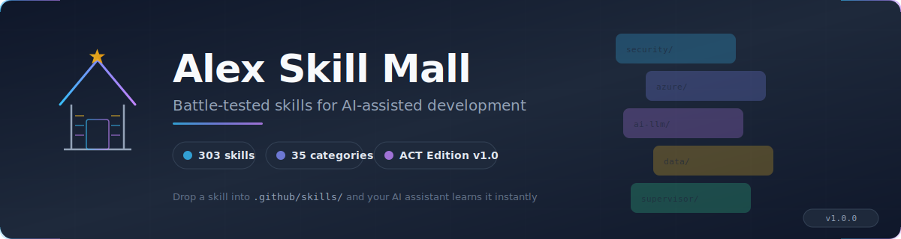

<p align="center">
  
</p>

# Alex Skill Mall

**Curated skills for AI-assisted work — from code to healthcare to fleet governance**

We develop original skills from real project experience, and we curate the best from the broader ecosystem. The Supervisor continuously evaluates skills from Microsoft, community stores, and internal repositories, then promotes the ones that meet our quality bar — with standardized frontmatter, stripped telemetry, and consistent structure.

The result: a single marketplace where your AI assistant finds expert knowledge across software engineering, cloud infrastructure, healthcare informatics, academic research, data analysis, publishing, security compliance, and AI agent governance. Drop a skill into your `.github/` folder and it learns instantly.

## Built for ACT Edition

The Mall's primary consumer is [**Alex ACT Edition**](https://github.com/fabioc-aloha/Alex_ACT_Edition) — an AI assistant brain built on the Artificial Critical Thinking (ACT) framework. Edition projects use `/find-skill` and `/install-from-mall` to shop the Mall directly.

The Mall also works with any AI assistant that reads `.github/` skill files:

| Surface | How it uses the Mall |
| --- | --- |
| **ACT Edition projects** | Native integration — `/find-skill`, `/install-from-mall`, auto-discovery via CATALOG.json |
| **GitHub Copilot** | Drop skills into `.github/skills/` — Copilot reads them as custom instructions |
| **Claude (Code + Desktop)** | Skills work as `.claude/` instructions or project knowledge files |
| **Cursor** | Copy skills into `.cursor/rules/` for context-aware completions |
| **Windsurf** | Skills load as `.windsurfrules` project knowledge |
| **Any AI assistant** | Plain Markdown — paste into system prompts, knowledge bases, or context files |

The [ACT Supervisor](https://github.com/fabioc-aloha/Alex_ACT_Supervisor) curates this Mall. The complete Supervisor package is available in [skills/supervisor/](skills/supervisor/) for anyone who wants to run their own curation instance.

## Quick Start

```bash
# Clone the skill mall
git clone https://github.com/fabioc-aloha/Alex_Skill_Mall.git

# Copy a skill to your project
cp -r Alex_Skill_Mall/skills/security/shell-injection-prevention/ /your/project/.github/skills/

# Or copy a whole category
cp -r Alex_Skill_Mall/skills/azure/ /your/project/.github/skills/
```

Your AI assistant (Copilot, Claude, Cursor, etc.) now has access to the skill.

## What's Here

### [Skills](skills/) — Hard Knowledge (301 skills)

Expert knowledge across 35 domains:

| Category | Count | What They Solve |
| --- | --- | --- |
| [Security](skills/security/) | 48 | XSS, injection, API hardening, secrets, threat modeling, SFI compliance, bug hunting |
| [Quality](skills/quality/) | 25 | Code review, testing strategies, audit patterns, deployment safety |
| [Documentation](skills/documentation/) | 20 | Mermaid, docs decay, count drift, version stamps, coauthoring |
| [AI / LLM](skills/ai-llm/) | 19 | MCP servers, agents, RAG, prompt engineering, evals, plugin governance |
| [Azure](skills/azure/) | 19 | Graph API, Fabric, OpenAI, deployment, Entra, MSAL, IaC import, cost optimization |
| [Data](skills/data/) | 17 | Power BI modeling, Fabric Lakehouse, KQL, semantic models, DAX, data visualization |
| [Supervisor](skills/supervisor/) | 17 | Fleet governance, Mall curation, release ritual, feedback triage — complete Supervisor package |
| [Critical Thinking](skills/critical-thinking/) | 15 | ACT pass, hypothesis debugging, root cause, problem framing |
| [Media](skills/media/) | 14 | Banners, SVG, image processing, presentations |
| [Architecture](skills/architecture/) | 14 | Microservices, saga orchestration, API connectors, workflow patterns |
| [Domain](skills/domain/) | 12 | Healthcare informatics, legal compliance, financial analysis, localization, sales enablement |
| [Converters](skills/converters/) | 11 | Word, PDF, EPUB, LaTeX, PPTX, HTML, email, plain text |
| [Process](skills/process/) | 10 | Release preflight, git workflow, scope management, risk |
| [Academic](skills/academic/) | 7 | Editorial judgment, survey verification, research methodology |
| [Communication](skills/communication/) | 5 | Executive storytelling, stakeholder management, status reports |
| [Build](skills/build/) | 5 | Path rot, config separation, data-driven layouts |
| [Cross-Platform](skills/cross-platform/) | 5 | Path handling, regex, line endings, shell quirks |
| [Publishing](skills/publishing/) | 4 | KDP, book publishing, editorial workflows |
| [Productivity](skills/productivity/) | 4 | Workflow optimization, deep work, automation patterns |
| [People](skills/people/) | 4 | Team dynamics, mentoring, collaboration |
| [Infrastructure](skills/infrastructure/) | 4 | IaC, Bicep AVM, Dockerfiles, ASP.NET containerization |
| [Operations](skills/operations/) | 4 | Postmortem, observability, monitoring, Copilot usage metrics |
| [Frontend](skills/frontend/) | 3 | React, CSS, responsive patterns |
| [VitePress](skills/vitepress/) | 3 | Iframe embed, clean URLs, SPA routing |
| [VS Code](skills/vscode/) | 3 | Extension patterns, config validation, environment |
| [Design](skills/design/) | 2 | UI/UX patterns, design systems |
| [GitHub](skills/github/) | 2 | README override, Wiki structure |
| [Privacy](skills/privacy/) | 2 | Responsible AI, data protection |
| [Visual](skills/visual/) | 2 | Image embedding, storage split |
| [Windows/Node](skills/windows-node/) | 2 | Winget collisions, PAT expiration |
| [Testing](skills/testing/) | 1 | Python mock patching location |
| [JavaScript](skills/javascript/) | 1 | Boolean string trap |
| [Cloud](skills/cloud/) | 1 | Azure SWA gotchas (12 issues) |
| [GitHub Actions](skills/github-actions/) | 1 | Version upgrades |
| [Performance](skills/performance/) | 1 | CPU, memory, network profiling |

[Browse the full catalog →](CATALOG.json) (machine-readable JSON — use `/find-skill` for search)

Need something not in this Mall? Run `/feedback` in your project to request it. The Supervisor evaluates external stores and promotes skills here.

### [Scaffolds](scaffolds/) — Project Starters

Pre-configured projects that actually deploy:

| Scaffold | Stack | What You Get |
| --- | --- | --- |
| [vite-azure-swa](scaffolds/vite-azure-swa/) | Vite + Azure Static Web Apps | SPA with auth, CI/CD, correct config |

### [Patterns](patterns/) — Cross-Domain Solutions

Reusable patterns that apply everywhere:

| Pattern | Description |
| --- | --- |
| [Champion-Challenger Cache](patterns/champion-challenger-cache.md) | Hash LLM inputs, skip API if unchanged |

## Where Skills Come From

Skills arrive from three streams. Every skill passes the same quality gates regardless of origin.

| Source | How it works | Examples |
| --- | --- | --- |
| **Original** | Built from real project friction — the gotcha you hit, documented so nobody hits it again | Shell injection prevention, TMDL linter false positives, boolean string trap |
| **Curated from external stores** | The Supervisor scans 19+ plugin stores (Microsoft, community, internal), evaluates with a five-dimension scorecard, strips telemetry, standardizes frontmatter, and promotes | CodeQL skills from `.github-private`, Fabric skills from `awesome-copilot`, enterprise patterns from `wshobson-agents` |
| **Promoted from projects** | Fleet projects surface patterns through `/feedback` — the Supervisor triages and generalizes | Cross-platform path gotchas, Azure SWA deployment issues |

The [Supervisor](skills/supervisor/) automates this pipeline: `/scan-stores` to discover, `/add-store` to evaluate, `/audit-mall` to keep it fresh.

## Quality Standard

Every skill in this repo has passed:

| Gate | Requirement |
| --- | --- |
| **Time savings** | Would save 30+ minutes of work — debugging, research, or ramp-up |
| **Non-obvious** | Encodes expertise that isn't a quick search away |
| **Battle-tested** | Used in a real project or domain |
| **Specific** | Solves a concrete problem with actionable guidance |
| **Current** | Still relevant and maintained (currency-stamped) |

If a skill doesn't teach your AI assistant something it wouldn't already know, it doesn't belong here.

## Works With Any AI Assistant

This Mall is AI-platform agnostic. Skills are plain Markdown — they work with GitHub Copilot, Claude, Cursor, Windsurf, or any AI assistant that reads `.github/` files. The machine-readable [CATALOG.json](CATALOG.json) enables programmatic search and auto-discovery.

## Using the Mall

### From a VS Code project

1. Run `/find-skill <keyword>` to search
2. Run `/install-from-mall` for guided install with project-needs assessment
3. Skills install into `.github/skills/local/` (survives Edition upgrades)

### Clone for local access

```bash
git clone https://github.com/fabioc-aloha/Alex_Skill_Mall.git ~/Alex_Skill_Mall
```

## Contributing

Found expertise worth sharing? [See the contribution guide](CONTRIBUTING.md).

Skills must:

1. Solve a real problem you've encountered — in code, in a domain, or in a workflow
2. Save meaningful time (debugging, research, ramp-up, or decision-making)
3. Encode knowledge that isn't a quick search away
4. Include actionable guidance, not just theory

## License

MIT — use freely, contribute back.

## Origin

These skills are extracted from [Alex](https://github.com/fabioc-aloha/alex) — the cognitive architecture for AI-assisted development. The Knowledge Base shares the hard skills without the full brain infrastructure.


