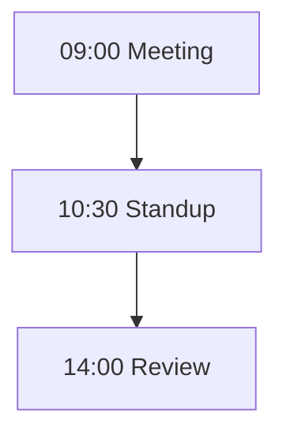
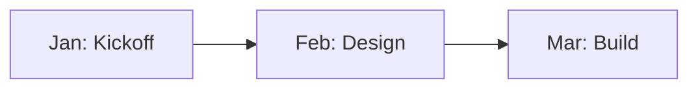
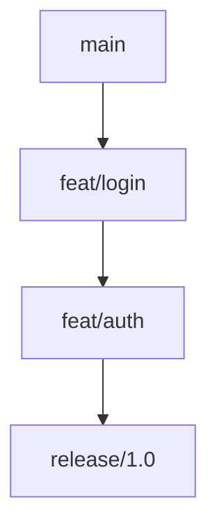
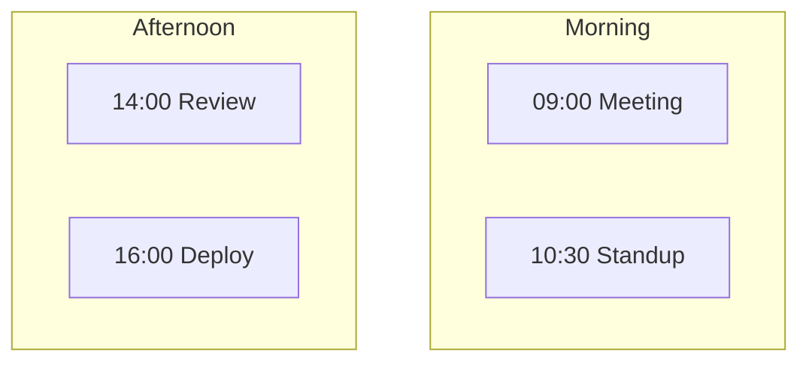

# Mermaid Mode Fragility

**Category**: Documentation
**Time Saved**: 30-60 minutes debugging silent render failures
**Battle-tested**: Yes — multiple diagram types failed in production

---

## The Problem

You write a Mermaid diagram in your docs. The syntax is valid. The diagram renders locally. You push it live and... blank space. Or worse, corrupted output. No error message.

## Why It Happens

Several Mermaid diagram modes have undocumented constraints around colons (`:`) and other characters. They fail silently or produce garbage output.

## The Fragile Modes

### 1. Timeline Mode

Uses `:` as time/event separator. Breaks on `HH:MM` times.

```mermaid
timeline
  title Project Timeline
  2024-01 : Project kickoff
  2024-02 : Design complete
  10:30 : Daily standup    ← BREAKS: colon in time value
```

### 2. GitGraph Mode

Long linear chains with colon-bearing quoted tags fail to render.


### 3. Gantt Mode

`dateFormat HH:mm` mis-parses task lines with times.

```mermaid
gantt
  dateFormat HH:mm
  title Daily Schedule
  Meeting : 09:00, 1h         ← BREAKS: colon in description
  Standup : 10:30, 30m
```



## The Rule

**Default to flowchart for any diagram with arbitrary text labels.**

Flowchart (TB/LR/TD) is the only Mermaid mode that reliably survives complex content:



## Safe vs Fragile Modes

| Mode | Status | Constraint |
|------|--------|------------|
| `flowchart` | ✅ Safe | None — handles any content |
| `sequenceDiagram` | ✅ Safe | Standard message format |
| `classDiagram` | ✅ Safe | Standard notation |
| `stateDiagram` | ⚠️ Caution | Colons in state names |
| `erDiagram` | ✅ Safe | Standard notation |
| `timeline` | ❌ Fragile | No colons in events |
| `gitGraph` | ❌ Fragile | Short chains only |
| `gantt` | ❌ Fragile | No HH:MM in dateFormat |
| `journey` | ⚠️ Caution | Score format sensitive |

## Flowchart Alternatives

### Instead of Timeline



### Instead of GitGraph



### Instead of Gantt



## Debugging Silent Failures

1. **Check browser console** — Mermaid sometimes logs parse errors
2. **Simplify content** — Remove colons, special chars
3. **Test incrementally** — Add nodes one at a time
4. **Try flowchart** — If it works in flowchart, the mode is the problem

## Verification Checklist

- [ ] Does diagram contain colons in text?
- [ ] Using a fragile mode (timeline, gitGraph, gantt)?
- [ ] Test in Mermaid Live Editor before committing
- [ ] Consider flowchart for complex text content

## Related Skills

- `docs-decay-velocity` — Documentation maintenance
